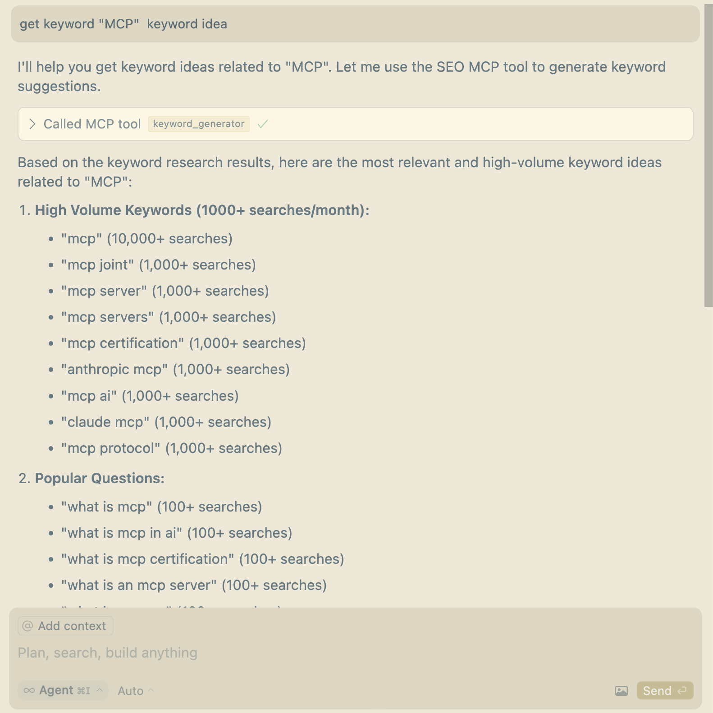

# SEO MCP

一个基于 Ahrefs 数据的免费 SEO 工具 MCP（Model Control Protocol）服务。包括反向链接、关键词创意等功能。

[English Version](README.md)

## 概述

本服务提供 API 以检索网站的 SEO 数据。它处理整个过程，包括验证码解决、身份验证以及从 Ahrefs 获取数据。

> 此 MCP 服务仅用于学习目的，请勿滥用，否则后果自负。本项目灵感来源于`@哥飞社群`。

关于此 MCP 服务的更多信息，请参考[Claude MCP SEO MCP 介绍](https://www.claudemcp.com/servers/seo-mcp)。

## 功能特点

- 🔍 检索任何域名的反向链接数据
- 🔎 获取关键词创意和 SEO 建议
- 🔒 使用 CapSolver 自动解决验证码
- 💾 签名缓存以减少 API 调用
- 🚀 快速高效的数据检索
- 🧹 简化输出，提供最相关的 SEO 信息

## 安装方法

### 前提条件

- Python 3.10 或更高版本
- CapSolver 账户和 API 密钥（在[此处注册](https://dashboard.capsolver.com/passport/register?inviteCode=1dTH7WQSfHD0)）
- 已安装`pip`或`uv`（在 macOS 上，可能需要使用`brew install uv`安装）

### 从 PyPI 安装

```bash
pip install seo-mcp
```

或使用`uv`：

```bash
uv pip install seo-mcp
```

### 手动安装

1. 克隆仓库：

   ```bash
   git clone https://github.com/cnych/seo-mcp.git
   cd seo-mcp
   ```

2. 使用 pip 或 uv 安装依赖：

   ```bash
   pip install -e .
   # 或
   uv pip install -e .
   ```

3. 设置 CapSolver API 密钥：
   ```bash
   export CAPSOLVER_API_KEY="your-capsolver-api-key"
   ```

## 使用方法

### 运行服务

您可以通过以下几种方式运行服务：

#### 在 Claude Desktop 中安装

要在 Claude Desktop 中安装此服务并立即与之交互：

```bash
fastmcp install src/seo_mcp/server.py
```

#### 使用 MCP Inspector 进行测试

用于开发和测试：

```bash
fastmcp dev src/seo_mcp/server.py
```

#### 在 Cursor IDE 中安装

在 Cursor 设置中，切换到 MCP 选项卡，点击`+添加新的全局MCP服务`按钮，然后输入以下内容：

```json
{
  "mcpServers": {
    "SEO MCP": {
      "command": "uvx",
      "args": ["--python 3.10", "seo-mcp"],
      "env": {
        "CAPSOLVER_API_KEY": "CAP-xxxxxx"
      }
    }
  }
}
```

您也可以在项目根目录创建`.cursor/mcp.json`文件并输入上述内容，这样就是一个特定项目的 MCP 服务。

> `CAPSOLVER_API_KEY`环境变量可以从[这里](https://dashboard.capsolver.com/passport/register?inviteCode=1dTH7WQSfHD0)获取。

接下来，我们可以在 Cursor 中使用这个 MCP：




### API 参考

该服务公开以下 MCP 工具：

#### `get_backlinks_list(domain: str)`

检索指定域名的反向链接列表。

**参数：**

- `domain`（字符串）：要查询的域名（例如："example.com"）

**返回：**
反向链接对象列表，每个对象包含：

- `anchor`：反向链接的锚文本
- `domainRating`：域名评分（0-100）
- `title`：链接页面的标题
- `urlFrom`：包含反向链接的页面 URL
- `urlTo`：被链接到的 URL
- `edu`：布尔值，表示是否来自教育网站
- `gov`：布尔值，表示是否来自政府网站

**示例响应：**

```json
[
  {
    "anchor": "示例链接",
    "domainRating": 76,
    "title": "有用资源",
    "urlFrom": "https://referringsite.com/resources",
    "urlTo": "https://example.com/page",
    "edu": false,
    "gov": false
  },
  ...
]
```

#### `keyword_generator(keyword: str, country: str = "us", search_engine: str = "Google")`

获取指定关键词的创意和 SEO 建议。

**参数：**

- `keyword`（字符串）：要查询的关键词
- `country`（字符串）：国家代码（例如："us"）
- `search_engine`（字符串）：搜索引擎（例如："Google"）

**返回：**

- 关键词创意列表，包含两种类型：

  - `keyword ideas`：常规关键词建议，包含关键词、国家、难度、搜索量和更新时间
  - `question ideas`：问题类关键词建议，格式相同

  每个关键词对象包含：

  - `keyword`：关键词文本
  - `country`：国家代码
  - `difficulty`：难度评级（Easy、Medium、Hard 或 Unknown）
  - `volume`：搜索量级别（如 MoreThanOneHundred、MoreThanOneThousand）
  - `updatedAt`：数据更新时间

## 开发

出于开发目的，您可以克隆仓库并安装开发依赖：

```bash
git clone https://github.com/cnych/seo-mcp.git
cd seo-mcp
uv sync  # 或使用 pip install -e .
```

## 工作原理

1. 服务首先尝试检索域名的缓存签名
2. 如果不存在有效缓存，它会：
   - 使用 CapSolver 解决 Cloudflare Turnstile 验证码
   - 从 Ahrefs 获取签名和有效期
   - 缓存此信息以供将来使用
3. 使用签名检索 SEO 数据
4. 处理并返回简化的 SEO 信息

## 故障排除

- **CapSolver API 密钥错误**：确保正确设置了`CAPSOLVER_API_KEY`环境变量
- **速率限制**：如果遇到速率限制，请尝试减少使用服务的频率
- **无结果**：某些域名可能没有反向链接或未被 Ahrefs 索引
- **问题**：如果遇到 SEO MCP 的问题，请查看[SEO MCP GitHub 仓库](https://github.com/cnych/seo-mcp)获取故障排除指南

## 许可证

本项目根据 MIT 许可证授权 - 有关详细信息，请参阅 LICENSE 文件。
